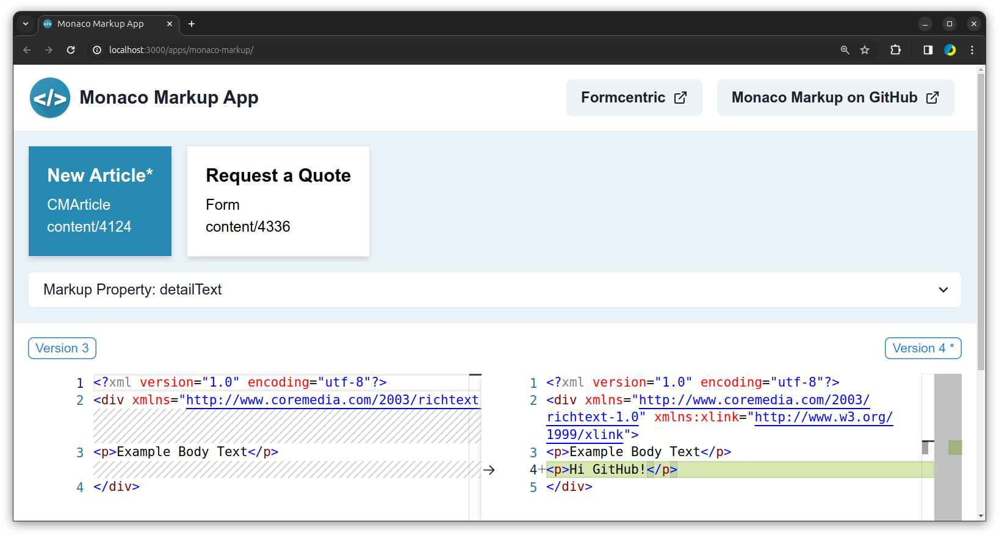
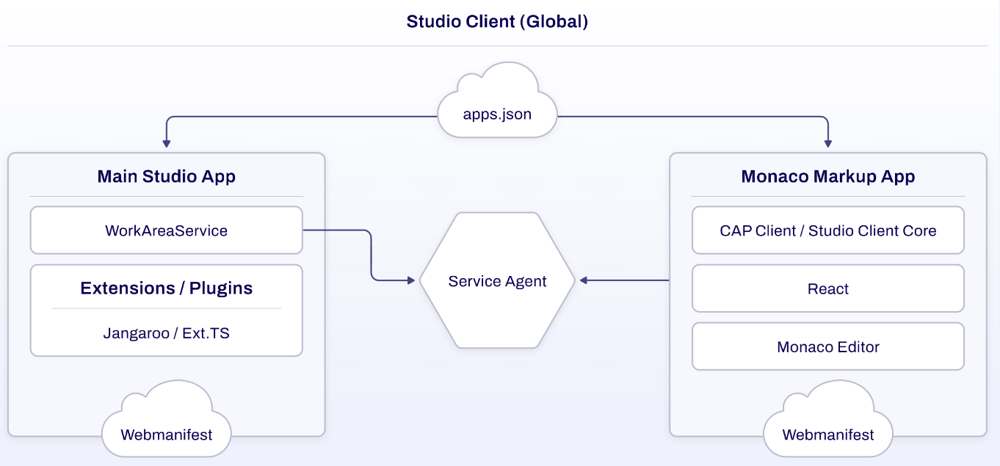

# Monaco Markup - An Example CoreMedia Studio App



## Introduction

This project aims to introduce the API and general setup of a Studio App within the
[CoreMedia Blueprint](https://documentation.coremedia.com/).

Monaco Markup was presented by [Formcentric](https://formcentric.com) at the [CoreMedia User Group](https://coremedia-usergroup.com/),
providing a live demonstration of its concepts and capabilities. A recording of the talk will be available on
[YouTube](https://www.youtube.com/@coremediausergroup66) shortly.

**Note:** This is a prototype designed for instructional purposes, emphasizing the exploration of CoreMedia Studio App
development. The code is not optimized for production use, and caution should be exercised when considering
deployment outside a development environment.



## Expertise that you can count on

As a Gold and Certified Partner, we improve your user experience with the CoreMedia Experience Platform.
With our expertise in strategy and conception, we work together to create high-quality solutions that meet tomorrow's
standards today.

Talk to us today about your needs and requirements: [www.monday-consulting.com](https://www.monday-consulting.com/en/services/cms/coremedia-partnership/)

## Setup / Quick Start

This section assumes that a CoreMedia Blueprint in version 2401.2 is available and that the `studio-client` app can
be successfully built using `pnpm`.

1. **Navigate to the `studio-client` app directory:**
    ```
    cd apps/studio-client
    ```

2. **Clone the repository as a submodule:**
    ```
    git submodule add git@github.com:Formcentric/monaco-markup-studio-app.git apps/monaco-markup
    ```

3. **Add the project to `pnpm-workspace.yaml`:**
    ```
    packages:
      - "apps/monaco-markup/app"
    ```

4. **Add the app to the global studio:**
    ```
    cd global/studio
    pnpm add @formcentric/studio-client.monaco-markup.app@1.0.0-SNAPSHOT
    ```

5. **Add the app to the `appPath` in `jangaroo.config.js`:**
    ```
    appPaths: {
      "@formcentric/studio-client.monaco-markup.app": {
        buildDirectory: "dist"
      },
    },
    ```

6. **Install, build & run:**
    ```
    pnpm i
    pnpm -r build
    cd global/studio
    pnpm start
    ```

   This will start the development server. Open your web browser and navigate to http://localhost:3000 to access the
   Monaco Markup app within the CoreMedia Studio environment.

## Built with

- [CoreMedia](https://www.coremedia.com/) - a powerful content management system that enables organizations to create,
  manage, and deliver digital content across various channels.
- [React](https://reactjs.org/) - a JavaScript library for creating user interfaces.
- [Monaco Editor](https://github.com/microsoft/monaco-editor) - the fully featured code editor from
  [VS Code](https://github.com/microsoft/vscode).
- [Monaco Editor for React](https://github.com/suren-atoyan/monaco-react)
- [Chakra UI](https://github.com/chakra-ui/chakra-ui/) - Simple, Modular & Accessible UI Components for your React
  Applications 
